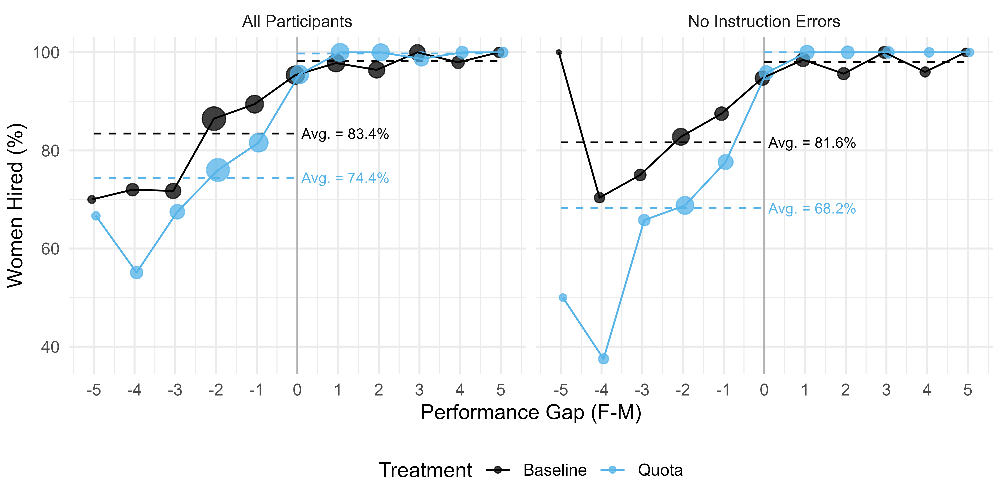
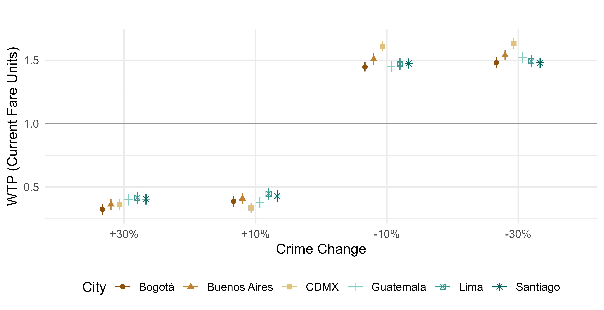
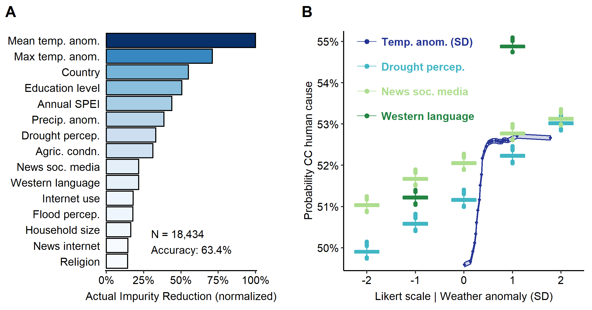

# Working Papers  

## [**The Backlash of Gender Quotas**](../files/GMM_QuotaBacklash.pdf)
**With Alejandro Martínez-Marquina**

Funded by the [Institute for Outlier Research in Business](https://www.marshall.usc.edu/institutes-and-centers/institute-for-outlier-research-in-business).

*Quotas trigger negative spillovers to women not targeted by the policy, who become less likely to be hired, making quotas ineffective on aggregate:*

<small>Abstract</small>
<small>

 Gender quotas are used to address gender disparities, but they may trigger backlash that undermines their effectiveness. In an online hiring experiment, requiring recruiters to hire a female candidate for one position leads them to penalize women in other, uncovered positions, offering lower salaries and making them twice as likely to receive no offer. No such effect arises when quotas mandate hiring men. Backlash emerges among supporters and opponents of equity policies, and renders the quota policy ineffective. Under the quota, women are evaluated jointly with quota beneficiaries, unintentionally raising the bar for the group the policy aims to promote. 

</small>

 

## [**Safety First: Crime and the Demand for Public Transportation in Latin America**](../files/DGP_SafetyFirst.pdf)
**With Santiago De Martini & Santiago Perez-Vincent**

Funded by the IDB, first released as [IDB Working Paper 1662](https://publications.iadb.org/en/publications/english/viewer/The-Impact-of-Crime-Perception-on-Public-Transport-Demand-Evidence-from-Six-Latin-American-Capitals.pdf)

*Transit users across Latin America are willing to pay over 50% higher fares to reduce crime in public transport:*

 

<small>Abstract</small>
<small>

Public transportation is key to reducing urban pollution and congestion, yet crime may deter its use. We study how crime affects transportation demand, price elasticity, and policy support through a pre-registered survey experiment with over 5,000 participants in six Latin American capital cities. First, we find that commuters are willing to pay over 50% of the current fare to avoid higher-crime routes, revealing the centrality of safety in modal choice. Second, crime lowers the likelihood of choosing public over private transport, and reduces price sensitivity, weakening the effectiveness of subsidies —especially among women and frequent riders. Third, higher crime perception increases support for safety investments but does not crowd out environmental goals in a budget allocation task. Together, the results show that crime imposes negative externalities by distorting transportation choices, and highlight complementarities between safety and sustainability agendas in urban policy.

</small>

 

## [**Reading Minds to Win: Cognitive and Affective Skills in Children’s Strategic Play**](../files/tomKids.pdf)
**With Antonio Alfonso, Pablo Brañas, Isabelle Brocas, Juan Carrillo & María José Vázquez**. 

<small>Abstract</small>
<small>

Do children use information to their own advantage? Is this ability related to emotional intelligence? To answer these questions, we conduct a large lab-in-the-field experiment with 1,662 participants from 8 to 18 years old who play a game with two-sided private information. We show that participants of all ages understand the fundamental relationship between action and private information. The ability to select payoff-enhancing strategies steadily increases with age but the capacity to recognize subtle variations in incentives triggered by changes in game structure remains elusive even for individuals at their peak cognitive capacity. Remarkably, participants of all ages who have heightened emotional intelligence exhibit a greater tendency to anticipate the behavior of others, best respond to them and, consequently, achieve higher payoffs. The paper thus reveals a strong, robust connection between affective and cognitive theory of mind in young populations. It also highlights the importance of empathic skills for decision making.

</small>

  

# Research In Progress

### [**Not All Cops Are Bayesian: Selection Neglect and Statistical Discrimination in Policing**](../files/GDNP_AllCopsAreBayesian.pdf) 
**With Santiago De Martini, Ervyn Norza & Santiago Perez-Vincent**.

Funded by the [Center for Effective Global Action](https://cega.berkeley.edu/).

<small>Abstract</small>
<small>

Crime predictions guide patrol allocation, stops, and searches, but crime data is not a representative sample of crime. Because minorities are over-selected into crime records, officers who fail to adjust for data selection may form biased beliefs even absent animus. We provide experimental evidence of this mechanism in a lab-in-the-field experiment with senior police officers in Colombia. Officers neglect data selection, translating differences in crime observability into prediction bias. Neglect is a representational failure, so algorithmic advice fails to debias predictions. Selection neglect offers a cognitive foundation for statistical discrimination in policing.

</small>

  

# Publications 
### [Multilevel Predictors of Climate Change Beliefs in Africa](https://doi.org/10.1371/journal.pone.0266387), *with Alfonso Sánchez*
PLoS One (2022).

*Main predictors of believing that climate change is caused by humans:*

<small>Abstract</small>
<small>

 Although Africa is the most vulnerable region to climate change, little research has focused on how climate change is perceived by Africans. Using machine learning, we analyze survey and climate data from second-order political boundaries to explore what predicts climate change beliefs in Africa. We include five different dimensions of climate change beliefs: climate change awareness, belief in anthropogenic climate change, risk perception, the need to stop climate change, and self-efficacy. Based on these criteria we identify five key results: (1) climate change in Africa is largely perceived through its negative impacts on agriculture; (2) actual changes in local climate conditions are related to climate change beliefs; (3) authoritarian and intolerant ideologies are associated to less climate change awareness, and a diminished risk perception and belief that it must be stopped; (4) women are less likely to be aware of climate change, and (5) not speaking French, English or Portuguese is linked to a hindered understanding of climate beliefs. Our combined results can help policy makers better understand the need to jointly consider the multilevel complexities of individual beliefs and hydroclimatic data for the development of more accurate adaptation and mitigation strategies to combat the impacts of climate change in Africa. 

</small>

